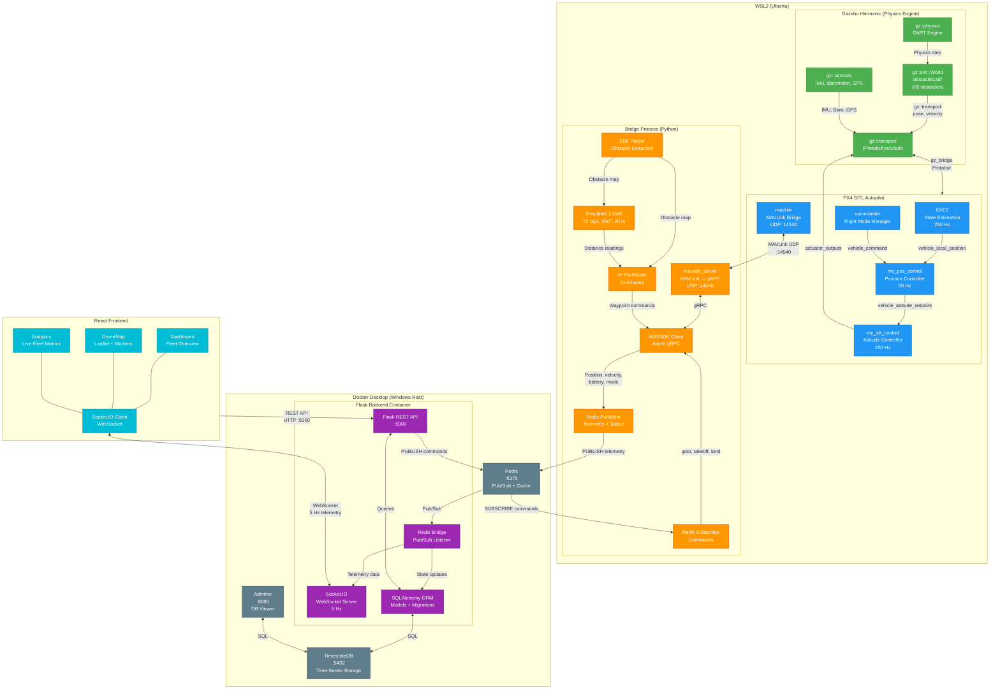

# ROS 2 / MAVSDK Runtime Node Graph

## Overview

Operation Sentinel uses **MAVSDK** (not MAVROS) for direct MAVLink communication with PX4.
This provides lower-latency, lighter-weight integration compared to the full ROS 2 / MAVROS stack.

The architecture below shows all runtime nodes, interfaces, and data flow.

---

## Runtime Node Graph

---

## Interface Summary

| Interface | Protocol | Rate | Direction |
|-----------|----------|------|-----------|
| Gazebo ↔ PX4 | gz::transport (Protobuf) | 250 Hz | Bidirectional |
| PX4 ↔ MAVSDK Server | MAVLink over UDP :14540 | 50 Hz | Bidirectional |
| MAVSDK Server ↔ Client | gRPC (local) | 50 Hz | Bidirectional |
| Bridge → Redis | PUBLISH (telemetry channel) | 20 Hz | Unidirectional |
| Redis → Bridge | SUBSCRIBE (commands channel) | Event-driven | Unidirectional |
| Redis → Backend | Pub/Sub listener | 20 Hz | Unidirectional |
| Backend → Frontend | WebSocket (Socket.IO) | 5 Hz | Unidirectional |
| Frontend → Backend | REST API (HTTP) | On-demand | Unidirectional |
| Backend ↔ TimescaleDB | SQL (SQLAlchemy) | ~1.7 Hz | Bidirectional |

## Key Design Decisions

1. **MAVSDK over MAVROS**: Direct MAVLink via MAVSDK provides lower latency and simpler deployment than the full ROS 2 / MAVROS stack. No ROS 2 installation required.

2. **Simulated LiDAR**: Parses `obstacles.sdf` for ground-truth obstacle positions, then ray-casts 72 beams. Produces clean training data without sensor noise.

3. **Redis Pub/Sub**: Decouples the Bridge from the Backend. Enables non-blocking command/telemetry flow across the WSL ↔ Docker boundary.

4. **Hybrid Control**: PX4 handles low-level flight control (250 Hz). AI layer handles mission planning and obstacle avoidance (10-50 Hz). Each operates at its optimal frequency.
